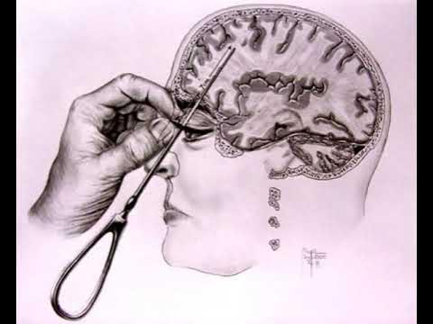

# Lobotomy Tetris

A twisted take on the classic Tetris game that loses its mind a little more every time you pull off a Tetris (4-line clear).



## What is Lobotomy Tetris?

It starts out like normal Tetris, but each time you clear 4 lines at once, the game gets... worse. More chaotic, more unpredictable, more broken. It’s Tetris with a mental breakdown.

## Features

### Core Gameplay
- Classic Tetris mechanics with a modern polish
- Hold piece system to store a piece for later
- Ghost piece preview to help with positioning
- Next piece preview to plan ahead
- Difficulty increases as you level up

### Lobotomy Effects (Triggered by Tetris clears)
- Visual glitches: screen warps, color distortion, UI chaos
- Piece mutations: blocks morph into new shapes
- Color cycling: wild, shifting block colors
- Forced piece locks: get stuck using the same piece
- Random board chaos: blocks blink in and out
- Turkey sandwich videos: yes, really
- Subway Surfers gameplay: because why not?
- Audio distortions: sounds spiral into madness

## Controls

| Key | Action |
|-----|--------|
| `←` `→` | Move piece left/right |
| `↑` | Rotate piece |
| `↓` | Soft drop (faster fall) |
| `Space` | Hard drop (instant fall) |
| `C` | Hold/swap piece |
| `Space` | Restart game (after game over) |

## How to Play

### Option 1: Easy Launch (Recommended)
1. Double-click `launch-game.exe`
2. It’ll open in your default browser
3. Play immediately

### Option 2: Manual Launch
1. Open `index.html` in any modern browser
2. Use keyboard controls to play
3. Good luck

## The Lobotomy Experience

As you clear more Tetrises, the glitch level increases:

- Level 0–2: Mostly normal, minor visual noise
- Level 3–5: Shapes mutate, colors shift
- Level 6–8: UI starts breaking, forced pieces appear
- Level 9–10: Pure chaos—blocks vanish, swap mid-fall, videos play, screen freaks out

## Technical Details

- Pure HTML5/CSS3/JavaScript — no frameworks
- Canvas rendering at 60fps
- Works on most screen sizes
- Compatible with all major browsers

## Project Structure

```
lobotomy-tetris/
├── index.html                  # Main game file
├── game.js                     # Game logic and chaos triggers
├── styles.css                  # Animations and styling
├── lobotomy.jpg                # Image overlay for Tetris clears
├── lobotomy.wav                # Sound effect for Tetris clears
├── turkey_sandwich.mp4         # Random chaos video
├── Subway_Surfers_Gameplay.mp4 # Another chaos video
├── launch-game.exe             # One-click launcher
└── README.md                   # You're looking at it
```

## Customization

You can tweak the chaos in `game.js`:

- `MAX_GLITCH`: Max glitch level (default: 10)
- `FORCED_PIECE_DURATION`: How long you're stuck with a piece (default: 10)
- `OVERLAY_DURATION`: How long the overlay image shows (default: 2000ms)

## Known "Features"

- Shapes may randomly become... not Tetris shapes
- Block colors will change without warning
- UI elements may rotate or disappear
- Videos might show up sideways or speed up
- It gets less playable the longer you survive

## Contributing

Want to break it more? Go for it:
- Add new glitch effects
- Include more weird videos
- Crank up the visual madness
- Push the game further into insanity

## Warning

This game includes:
- Flashing lights and erratic visuals
- Intentionally disorienting effects
- Difficulty that ramps into nonsense
- Chaos that may frustrate or amuse

Play at your own risk.

## License

See the [LICENSE](LICENSE) file for details.

---

*"The only winning move is not to play... but you'll play anyway."*
